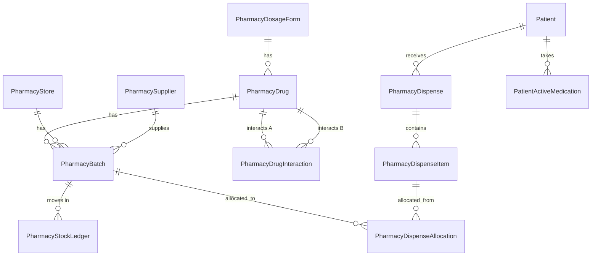
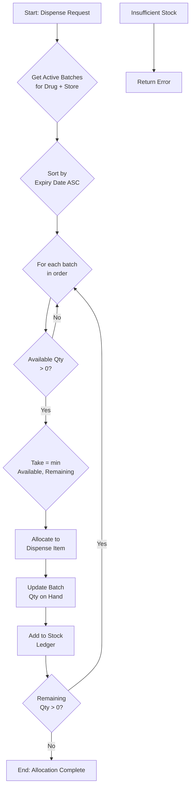

# Pharmacy Ghana-Ready Upgrade - Gap Analysis & Implementation Plan

## Executive Summary
This document outlines the comprehensive upgrade of the existing Pharmacy module to a Ghana-ready inventory and dispensing system with batch tracking (FEFO), role-based pricing, drug interactions, and improved prescribing UI.

## Current State Analysis

### ✅ Already Implemented
1. **Database Models** (13 tables) - Complete
   - pharmacy_dosage_form, pharmacy_drug, pharmacy_supplier, pharmacy_store
   - pharmacy_batch, pharmacy_stock_ledger
   - pharmacy_dispense, pharmacy_dispense_item, pharmacy_dispense_allocation
   - pharmacy_drug_interaction, pharmacy_role_policy, patient_active_medication

2. **Core Business Logic** - Mostly Complete
   - FEFO allocation algorithm (app/services/pharmacy_fefo.py)
   - Immutable stock ledger
   - Role-based pricing visibility functions
   - Drug interaction checking

3. **API Endpoints** - Partial
   - GET /pharmacy/formulary/search
   - GET /pharmacy/formulary/{drug_id}
   - GET /pharmacy/interactions/check
   - POST /pharmacy/stores/{store_id}/stock-in
   - GET /pharmacy/reports/near-expiry
   - GET /pharmacy/reports/controlled-register

4. **UI Pages** - Partial
   - Dashboard (pharmacy_ghana/dashboard.html)
   - Drugs list (pharmacy_ghana/drugs_list.html)
   - Batches (pharmacy_ghana/batches.html)
   - Near expiry report
   - Controlled register report

5. **Seeds** - Complete
   - Dosage forms (19 types)
   - Routes (11 types)
   - Sample formulations (15)
   - Drug interactions (7 pairs)
   - Role policies

---

## Gap Analysis & Missing Components

### 🚧 Missing API Endpoints

| Endpoint | Method | Description | Priority |
|----------|--------|-------------|----------|
| GET /pharmacy/stores | GET | List all pharmacy stores | HIGH |
| GET /pharmacy/stores/{id} | GET | Get single store details | HIGH |
| GET /pharmacy/drugs | GET | List all drugs/formulations | HIGH |
| POST /pharmacy/drugs | POST | Create new drug | HIGH |
| PUT /pharmacy/drugs/{id} | PUT | Update drug | HIGH |
| POST /pharmacy/stores/{store_id}/adjust-stock | POST | Adjust stock with reason | HIGH |
| POST /pharmacy/dispense | POST | Create dispense (draft) | HIGH |
| POST /pharmacy/dispense/{id}/add-item | POST | Add item to dispense | HIGH |
| POST /pharmacy/dispense/{id}/allocate | POST | Run FEFO allocation | HIGH |
| POST /pharmacy/dispense/{id}/finalize | POST | Finalize dispense | HIGH |
| GET /pharmacy/reports/stock-ledger | GET | Stock movement report | MEDIUM |
| POST /pharmacy/transfer | POST | Transfer between stores | MEDIUM |

### 🚧 Missing UI Pages

| Page | Description | Priority |
|------|-------------|----------|
| /pharmacy/ghana/dispense | Patient dispensing interface | HIGH |
| /pharmacy/ghana/drugs/add | Add new drug form | HIGH |
| /pharmacy/ghana/drugs/edit/{id} | Edit drug form | HIGH |
| /pharmacy/ghana/reports/ledger | Stock ledger report | MEDIUM |
| /pharmacy/ghana/stores | Store management | MEDIUM |

### 🚧 Prescribing Integration Gaps

| Component | Description | Priority |
|-----------|-------------|----------|
| Doctor prescribing UI | Integrate formulary search dropdown | HIGH |
| Interaction warnings | Show warnings in prescribing UI | HIGH |
| Dosage form inputs | Adapt dose input based on dosage form | HIGH |
| Substitution UI | Allow pharmacy substitution with approval | MEDIUM |

### 🚧 Business Logic Enhancements

| Feature | Description | Priority |
|---------|-------------|----------|
| Near-expiry warnings | Return warning info in FEFO | HIGH |
| Substitution policy | Handle out-of-stock substitutions | MEDIUM |
| Store transfers | Transfer stock between stores | MEDIUM |
| Batch status updates | Auto-mark expired/quarantined | LOW |

---

## Implementation Priority Order

### Phase 1: Complete API Endpoints (High Priority)
1. GET/POST /pharmacy/stores
2. GET/POST/PUT /pharmacy/drugs
3. POST /pharmacy/stores/{store_id}/adjust-stock
4. Full dispense workflow endpoints
5. Stock ledger report endpoint

### Phase 2: Missing UI Pages (High Priority)
1. Patient dispensing UI
2. Drug add/edit forms
3. Store management UI
4. Stock ledger report UI

### Phase 3: Prescribing Integration (High Priority)
1. Integrate formulary search in doctor prescribing
2. Add interaction warnings
3. Dose input based on dosage form
4. Substitution workflow

### Phase 4: Business Logic Enhancements
1. Near-expiry warnings in FEFO
2. Store transfer functionality
3. Auto batch status updates

### Phase 5: Testing
1. Unit tests for FEFO
2. Permission gating tests
3. Integration tests

---

## Database Schema Overview



---

## Mermaid: FEFO Allocation Flow



---

## Role-Based Access Matrix

| Feature | Admin | Head of Pharmacy | Pharmacy Staff | Doctor |
|---------|-------|------------------|----------------|--------|
| View Unit Cost | ✅ | ✅ | ❌ | ❌ |
| View Margin | ✅ | ✅ | ❌ | ❌ |
| Edit Selling Price | ✅ | ✅ | ❌ | ❌ |
| Adjust Stock | ✅ | ✅ | ❌ | ❌ |
| Approve Adjustment | ✅ | ✅ | ❌ | ❌ |
| Dispense Controlled | ✅ | ✅ | ❌ | ❌ |
| Prescribe | ✅ | ❌ | ❌ | ✅ |
| View Formulary | ✅ | ✅ | ✅ | ✅ |

---

## Acceptance Criteria

1. ✅ Doctors see dosage form + strength in formulary results and cannot prescribe generic-only items
2. ✅ Pharmacy receives stock into batches and sells/dispenses using FEFO automatically
3. ✅ Expired batches never dispensed; near-expiry warnings appear
4. ✅ Head of Pharmacy can see cost + margin; other users cannot
5. ✅ Interaction warnings appear at prescribing and dispensing
6. ✅ Stock ledger fully tracks movements and matches current stock

---

## File Structure

```
app/
├── models/
│   └── pharmacy_models.py          # ✅ Done
├── services/
│   └── pharmacy_fefo.py           # ✅ Done (needs near-expiry enhancement)
├── routers/
│   ├── pharmacy_ghana_api.py      # ⚠️ Needs more endpoints
│   └── pharmacy_ghana_ui_routes.py # ⚠️ Needs more pages
├── schemas/
│   └── pharmacy_schemas.py         # 🆕 Needs creation
├── crud/
│   └── pharmacy_crud.py           # 🆕 Needs creation
└── templates/
    └── pharmacy_ghana/
        ├── dashboard.html          # ✅ Done
        ├── drugs_list.html        # ✅ Done
        ├── batches.html           # ✅ Done
        ├── near_expiry.html       # ✅ Done
        ├── controlled_register.html # ✅ Done
        ├── dispense.html          # 🆕 Needs creation
        ├── drug_form.html        # 🆕 Needs creation
        ├── ledger.html           # 🆕 Needs creation
        └── stores.html           # 🆕 Needs creation
```

---

## Migration Notes

All database tables already exist via migration: `migrations/versions/add_pharmacy_ghana_ready.py`

No new migrations needed unless adding new columns.
